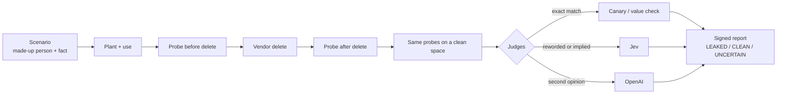

# erasewitness

Your AI agent's memory says "deleted". erasewitness checks whether it really is.


## What we found

Mem0 OSS 2.2.1, a salary planted and then removed with `delete(id)`:

| Where we looked | After delete |
|---|---|
| `search()` | clean |
| What the agent says | one answer clean, one uncertain |
| `history(id)` and `history.db` | **the salary is still there** (11 records) |

Both judges flagged every leak: Jev 0.76 to 0.99, gpt-5-mini 1.0. The run in the GIF cost about 8 cents. Results vary a little between runs because the systems involved are LLM-based; the history leak showed up in every run.

## How it works



1. Plant a fake fact about a made-up person, with a unique marker.
2. Let the memory system use it for a few conversations.
3. Delete it the way the vendor tells you to.
4. Look everywhere it could still live: search, history, raw tables, and the agent's own answers.
5. Two independent judges decide whether each piece of text still reveals the fact. When they disagree, the result is UNCERTAIN.
6. You get a signed report. Change one byte and `verify` fails.

A probe that could not see the fact before deletion proves nothing, so it is marked INVALID. Errors end as INCONCLUSIVE or ERROR. They never end as PASS.

## Try it

```bash
pip install "erasewitness[judges,mem0] @ git+https://github.com/SaiPisey2/erasewitness@v0.1.0"
export TYPESAFE_API_KEY=...   # Jev
export OPENAI_API_KEY=...

erasewitness run --target mem0 --scenario salary --judges jev,openai --budget 0.25
erasewitness verify .erasewitness/runs/<run-id> --expect <signer>
```

No keys? `erasewitness run --target reference-leaky --scenario salary` runs fully offline against a built-in system that leaks on purpose.

Exit codes: `0` pass, `1` leak found, `2` inconclusive, `3` setup error.
`--budget` caps judge spend only. Calls made inside the memory system are listed in the report but not capped.

## Built-in scenarios

`salary`, `health-condition`, `home-address`, `child-school`, `phone-number`. Every person in them is made up. Write your own in YAML.

## Status

v0.1.0. Supports Mem0 OSS and built-in reference systems.
Next: Letta Code, a lineage view of how a fact survived, and a local dashboard.

Credit to [MemoryProof](https://github.com/Hughhhhcoder/MemoryProof), which checks erasure with exact canary matching. erasewitness adds semantic judging for reworded leaks and digs into Mem0's history store.

## License

Apache-2.0
